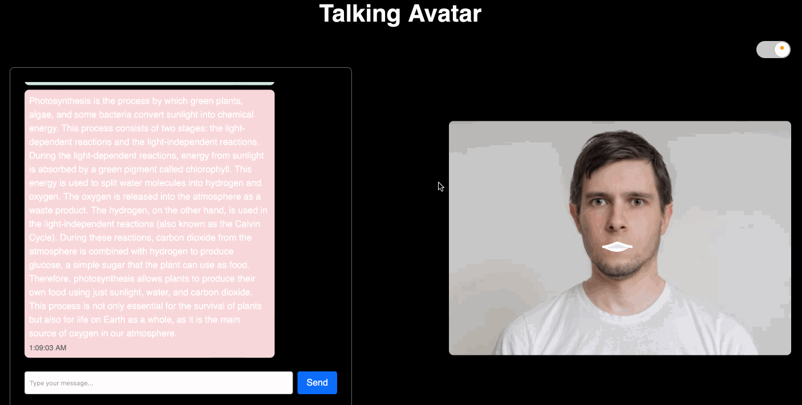

# 🗣️ Interactive Talking Avatar

Talking Avatar is an interactive, animated avatar that responds in real-time by overlaying SVG viseme images on a static image, synced with audio generated via the Azure Speech TTS service. The responses are powered by OpenAI, making the avatar both responsive and intelligent. By subscribing to the visemes event from Azure Speech, the avatar’s mouth movements are coordinated with speech, creating a natural talking effect.



## ✨ Features

- **Real-time animated avatar**: Syncs avatar mouth movements with speech using viseme events.
- **Speech generation**: Powered by Azure Speech Text-to-Speech (TTS) service.
- **AI-driven responses**: Utilizes OpenAI for generating interactive and dynamic conversations.
## 🚀 Getting Started

### Prerequisites
Before you begin, ensure you have the following:

**Node.js** installed on your system
**Azure Speech API keys**
**OpenAI API key**

#### 1. Clone the Repository
```bash
git clone https://github.com/AmoMTL/interactive-talking-avatar-vue-js-azure-speech-visemes
```

#### 2. Backend Setup
Navigate to the backend directory:

```bash
cd backend
```

Install the required dependencies:

```bash
npm install
```

#### 3. Set Environment Variables
Create a .env file in the backend directory and add your API keys:

```makefile
OPENAI_API_KEY=<your-openai-api-key>
AZURE_SPEECH_KEY=<your-azure-speech-api-key>
AZURE_SPEECH_REGION=<your-azure-region>
AZURE_VOICE_NAME=<azure-voice-name>
```

#### 4. Start the Backend Server
Run the backend server:

```bash
node server.js
```

#### 5. Frontend Setup
Navigate back to the root directory, then to the frontend folder:

```bash
cd ..
cd frontend
```
Install the frontend dependencies:

```bash
npm install
```

#### 6. Run the Frontend Development Server
Start the frontend:

```bash
npm run dev
```

### 🤝 Contributing

Feel free to submit issues and pull requests if you have any ideas or improvements. Contributions are always welcome!

### 📜 License

This project is licensed under the MIT License.
